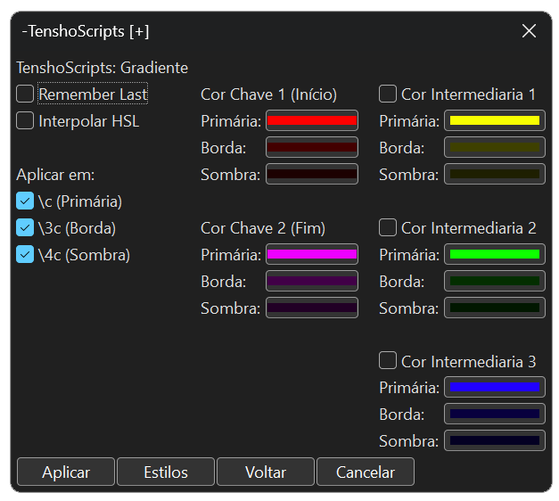
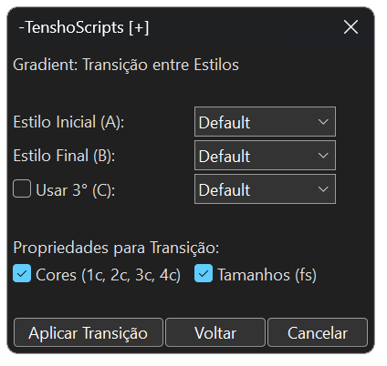
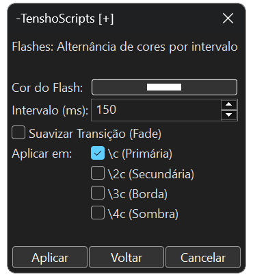
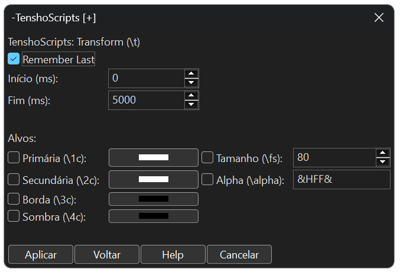
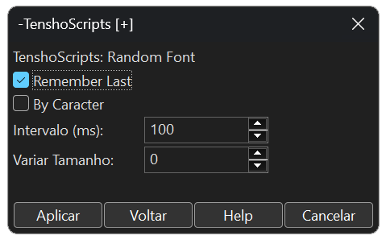

<h1 id="-português"></h1>

  

# 🐉 Documentação Oficial: TenshoScripts v1.0.1

Bem-vindo à documentação técnica do **TenshoScripts**. Este toolkit foi projetado para levar o Aegisub ao limite, focando em automações de Motion Graphics para a cena **Nerdcore** e **AMVs**, resolvendo limitações históricas de outros scripts.

---

## 🛠️ Diferenciais Técnicos (Por que usar?)

* **Navegação Recursiva:** Implementamos um botão **"Voltar"** em todas as GUIs. Você pode transitar entre ferramentas sem precisar fechar e reabrir o script pelo menu de automação.
* **Blindagem UTF-8 (Anti-Crash):** Utilizamos padrões de captura de 1 a 4 bytes para processar caracteres. Isso elimina o erro de **C++ Exception** ao fatiar letras acentuadas ou caracteres especiais, um problema crônico em scripts de fatiamento antigos.
* **Respeito ao Layout Original:** Todas as ferramentas inclusas detectam seu alinhamento (`\an`) e posição (`\pos`) originais, mantendo a integridade visual da frase.

---

## 1. Fadeworks Adaptado
Aplica transições de visibilidade complexas de forma simplificada, unindo Alpha e Cor.

### Parâmetros:
* **Fade In/Out:** Duração em milissegundos da entrada e saída ou em porcentagem em relação ao tempo da linha (exemplo: `Fade in: 0.4` fará o fade in na duração de 40% do tempo máximo da linha).
* **Alpha/Colour:** Define se o efeito afetará apenas a transparência ou se haverá transição de cores.
* **From/To:** Cores de início e fim do fade (ex: começar em branco e terminar na cor do estilo).
* **By Letter:** Ativa o sequenciamento caractere por caractere.
* **Direção:** Escolha entre **LTR** (esquerda para direita), **RTL** (direita para esquerda), **Meio->Fora** ou **Fora->Meio**.

---

## 2. Gradiente Fácil (Multi-Ponto)
Gera gradientes letra por letra com até 5 cores chave e interpolação avançada, ou automaticamente pelos estilos.

  <table>
    <tr>
      <td align="center" width="50%">
        <strong>Easy Gradient (Multi-Ponto)</strong> 
        
      </td>
      <td align="center" width="50%">
        <strong>Gradient: Style Transition</strong> 
        
      </td>
    </tr>
  </table>

### Parâmetros:
* **Interpolar HSL:** Transita as cores pelo espectro de Matiz, Saturação e Luminosidade, resultando em cores muito mais vivas que o modo RGB.
* **Cores Chave (1-5):** Define os pontos de transição. Ative as cores intermediárias para gradientes complexos.
* **Checkboxes Target:** Permite aplicar o gradiente seletivamente apenas em tags específicas (`\c`, `\3c` ou `\4c`).
* **Estilos (A, B, C):** O script lê automaticamente todos os estilos do seu arquivo. Você pode definir uma transição linear (A -> B) ou uma transição em três pontos (A -> C -> B).
* **Interpolação Completa:** Além das cores, você pode transitar tamanhos (`\fs`), criando efeitos de perspectiva ou crescimento orgânico do texto.

---

## 3. Flashes
Ideal para sincronizar o impacto visual com a batida da música.

### Parâmetros:
* **Cor do Flash:** Cor que a legenda assumirá durante o pico do flash.
* **Intervalo (ms):** Define o tempo entre as trocas de cor.
* **Alvos (\c, \3c, \4c):** Escolha se o flash afeta o preenchimento, a borda ou a sombra de forma independente.

---

## 4. Split Lines
Divide frases em camadas individuais.

### Funcionalidades:
* **Modos:** Dividir por **Caractere** ou por **Palavra**.
* **Filtro de Vácuo:** O script detecta espaços e caracteres invisíveis, calculando sua largura para manter o layout, mas **não cria** linhas vazias na grade.
* **Preservação de Tags:** Mantém as tags originais da linha em cada pedaço fatiado.

---

## 5. Transform (\t)
Ferramenta para criação rápida de animações de transformação sem necessidade de digitar tags manuais.

### Parâmetros:
* **Intervalo (ms):** Define o tempo de início e fim da animação. O tempo de fim padrão é preenchido automaticamente com a duração da linha.
* **Alvos de Cor:** Permite transformar de forma independente as cores Primária (`\1c`), Secundária (`\2c`), Borda (`\3c`) e Sombra (`\4c`).
* **Tamanho e Alpha:** Anima a variação de escala da fonte (`\fs`) e a transparência global (`\alpha`).

---

## 6. Random Font (Caos)
Cria um efeito de instabilidade através da oscilação rápida de fontes e tamanhos.

### Parâmetros:
* **Intervalo de Troca:** Define a velocidade da oscilação (Mínimo de `40ms` para garantir a renderização).
* **Variação de Tamanho:** Define um intervalo (ex: `5px`) para que o tamanho da fonte mude aleatoriamente para cima ou para baixo.
* **Modo Caractere:** Quando ativo, cada letra da frase assume uma fonte diferente entre si, gerando um efeito de distorção máxima.

## 7. YtktFade
Aplica o estilo de karaokê invisível otimizado para o renderizador do YouTube.

### Parâmetros:
* **Ativar \2c:** Define uma cor de preenchimento específica para o momento em que a sílaba é cantada, garantindo maior legibilidade no player do YouTube.

---

## 8. FixLines
Ferramenta de padronização de posição baseada em cálculos proporcionais.

### Funcionalidades:
* **Botões Rápidos:** Posicionamento instantâneo em **Topo** ou **Baixo**.
* **Resolução Inteligente:** Detecta automaticamente a `PlayRes` do vídeo e ajusta as coordenadas para que fiquem idênticas em qualquer resolução (ex: 720p ou 1080p).

---

## 9. Glitch Dinâmico (Pago)
Gera uma aberração cromática dinâmica com separação de canais de cor.

### Parâmetros:
* **Auto-Style:** Lê o seu estilo e gera cores de glitch harmonizadas automaticamente.
* **Offset (px):** Define a "violência" do efeito (quão longe as cores vão do centro).
* **Random Pos (Caos):** Gera posições aleatórias para um efeito de glitch mais orgânico e ruidoso.

---

## 10. Rainbow Wave (Pago)
Cria uma onda de cores arco-íris que flui pelo texto através de fatiamento temporal.

### Parâmetros:
* **Fatiamento (ms):** Define a suavidade. O padrão de **5ms** cria uma fluidez de 200 "frames" por segundo.
* **Speed & Width:** Controla a velocidade de deslocamento e quão larga é a transição de cor no texto.

---

## 11. Reverse Karaoke (Pago)
Inverte a lógica do karaokê comum: o texto começa visível e desaparece conforme a música toca.

### Como Usar:
Faça a divisão de sílabas padrão na linha (`\k`) e depois execute a automação.

### Diferencial Técnico:
Diferente de macros simples que apenas aplicam alpha, o TenshoScripts utiliza um sistema de fatiamento por camadas sincronizadas. Isso evita o bug de cintilação (*flicker*) do YouTube, garantindo uma renderização estável em qualquer dispositivo.

---

## 12. Curves (Pago) - BETA
Substitui o movimento linear do `\move` por curvas de aceleração e desaceleração (Easing).

  <table>
    <tr>
      <td align="center" width="50%">
        <strong>Curves (Presets Beta)</strong> 
        
      </td>
      <td align="center" width="50%">
        <strong>Curves: Advanced Bézier Editor</strong> 
        
      </td>
    </tr>
  </table>

### Parâmetros:
* **Ease Modes:** Presets clássicos como *Quad, Cubic* e *Linear*.
* **Controle de Bézier (Avançado):** Editor de curvas estilo "Flow", permitindo configurar os pontos de influência para movimentos totalmente personalizados.

---

Desenvolvido por [Tensho](https://x.com/otenshy). Licença MIT.

 
 

 
 

<h1 id="-english"></h1>

  
# 🐉 Official Documentation: TenshoScripts v1.0.1

Welcome to the technical documentation for **TenshoScripts**. This toolkit was designed to push Aegisub to its limits, focusing on Motion Graphics automation for the **Nerdcore** and **AMV** scene, solving historical limitations found in other scripts.

---

## 🛠️ Technical Differentials (Why use it?)

* **Recursive Navigation:** We implemented a **"Back"** button in all GUIs. You can navigate between tools without closing and reopening the script from the automation menu.
* **UTF-8 Shielding (Anti-Crash):** We use 1-to-4 byte capture patterns to process characters. This eliminates the **C++ Exception** error when slicing accented letters or special characters, a chronic issue in older slicing scripts.
* **Layout Integrity:** All included tools detect your original alignment (`\an`) and position (`\pos`), maintaining the visual integrity of the line.

---
