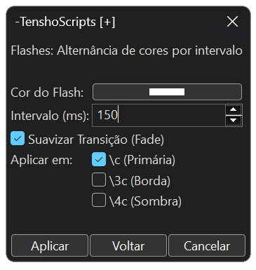

# 🐉 Documentação Oficial: TenshoScripts v1.0.0

Bem-vindo à documentação técnica do **TenshoScripts**. Este toolkit foi projetado para levar o Aegisub ao limite, focando em automações de Motion Graphics para a cena **Nerdcore** e **AMVs**, resolvendo limitações históricas de outros scripts.

---

## 🛠️ Diferenciais Técnicos (Por que usar?)

* **Navegação Recursiva:** Implementamos um botão **"Voltar"** em todas as GUIs. Você pode transitar entre ferramentas sem precisar fechar e reabrir o script pelo menu de automação.
* **Blindagem UTF-8 (Anti-Crash):** Utilizamos padrões de captura de 1 a 4 bytes para processar caracteres. Isso elimina o erro de **C++ Exception** ao fatiar letras acentuadas ou caracteres especiais, um problema crônico em scripts de fatiamento antigos.
* **Respeito ao Layout Original:** Todas as ferramentas inclusas detectam seu alinhamento (`\an`) e posição (`\pos`) originais, mantendo a integridade visual da frase.

---

## 1. Fadeworks Adaptado
Aplica transições de visibilidade complexas de forma simplificada, unindo Alpha e Cor.

### Parâmetros:
* **Fade In/Out:** Duração em milissegundos da entrada e saída ou em porcentagem em relação ao tempo da linha (exemplo: `Fade in: 0.4` fará o fade in na duração de 40% do tempo máximo da linha).
* **Alpha/Colour:** Define se o efeito afetará apenas a transparência ou se haverá transição de cores.
* **From/To:** Cores de início e fim do fade (ex: começar em branco e terminar na cor do estilo).
* **By Letter:** Ativa o sequenciamento caractere por caractere.
* **Direção:** Escolha entre **LTR** (esquerda para direita), **RTL** (direita para esquerda), **Meio->Fora** ou **Fora->Meio**.

---

## 2. Flashes
Ideal para sincronizar o impacto visual com a batida da música (*kicks* e *snares*).

### Parâmetros:
* **Cor do Flash:** Cor que a legenda assumirá durante o pico do flash.
* **Intervalo (ms):** Define o tempo entre as trocas de cor.
* **Alvos (\c, \3c, \4c):** Escolha se o flash afeta o preenchimento, a borda ou a sombra de forma independente.

---

## 3. Gradient (Multi-Ponto)
Gera gradientes letra por letra com até 5 cores chave e interpolação avançada.

### Parâmetros:
* **Interpolar HSL:** Transita as cores pelo espectro de Matiz, Saturação e Luminosidade, resultando em cores muito mais vivas que o modo RGB.
* **Cores Chave (1-5):** Define os pontos de transição. Ative as cores intermediárias para gradientes complexos.
* **Checkboxes Target:** Permite aplicar o gradiente seletivamente apenas em tags específicas (`\c`, `\3c` ou `\4c`).

---

## 4. Split Lines
Divide frases em camadas individuais. Fundamental para preparar textos para Motion Graphics.

### Funcionalidades:
* **Modos:** Dividir por **Caractere** ou por **Palavra**.
* **Filtro de Vácuo:** O script detecta espaços e caracteres invisíveis, calculando sua largura para manter o layout, mas **não cria** linhas vazias na grade.
* **Preservação de Tags:** Mantém as tags originais da linha em cada pedaço fatiado.

---

## 5. FixLines
Ferramenta de padronização de posição baseada em cálculos proporcionais.

### Funcionalidades:
* **Botões Rápidos:** Posicionamento instantâneo em **Topo**, **Meio** ou **Baixo**.
* **Resolução Inteligente:** Detecta automaticamente a `PlayRes` do vídeo e ajusta as coordenadas para que fiquem idênticas em qualquer resolução (ex: 720p ou 1080p).
* **Preservação de Glitch:** Se aplicado em uma linha que já tem deslocamento horizontal (Glitch), o script altera apenas o eixo Y, mantendo o efeito intacto.

---

## 6. YtktFade
Aplica o estilo de karaokê invisível otimizado para o renderizador do YouTube.

### Parâmetros:
* **Ativar \2c:** Define uma cor de preenchimento específica para o momento em que a sílaba é cantada, garantindo maior legibilidade no player do YouTube.

---

## 7. Glitch (Exclusive)
Gera uma aberração cromática dinâmica com separação de canais de cor.

### Parâmetros:
* **Auto-Style:** Lê o seu estilo e gera cores de glitch harmonizadas automaticamente.
* **Offset (px):** Define a "violência" do efeito (quão longe as cores vão do centro).
* **Random Pos (Caos):** Gera posições aleatórias para um efeito de glitch mais orgânico e ruidoso.

---

## 8. Rainbow Wave (Exclusive)
Cria uma onda de cores arco-íris que flui pelo texto através de fatiamento temporal.

### Parâmetros:
* **Fatiamento (ms):** Define a suavidade. O padrão de **5ms** cria uma fluidez de 200 "frames" por segundo.
* **Speed & Width:** Controla a velocidade de deslocamento e quão larga é a transição de cor no texto.

---

## 9. Curves (Exclusive)
Substitui o movimento linear do `\move` por curvas de aceleração e desaceleração (Easing).

### Parâmetros:
* **Ease Modes:** Presets clássicos como *Quad, Cubic* e *Linear*.
* **Controle de Bézier (Avançado):** Editor de curvas estilo "Flow" ou After Effects, permitindo configurar os pontos de influência para movimentos totalmente personalizados.

---

## 10. Reverse Karaoke (Exclusive)
Inverte a lógica do karaokê comum: o texto começa visível e desaparece conforme a música toca.

### Diferencial Técnico:
Diferente de macros simples que apenas aplicam alpha, o TenshoScripts utiliza um sistema de fatiamento por camadas sincronizadas. Isso evita o bug de cintilação (*flicker*) do YouTube, garantindo uma renderização estável em qualquer dispositivo.

---
Desenvolvido por [Tensho](https://x.com/otenshy). Licença MIT.
