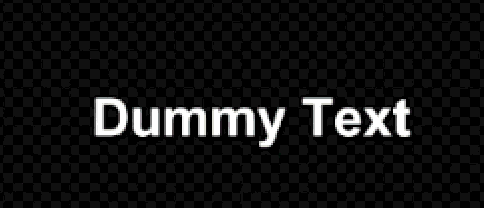
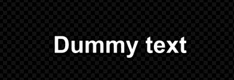
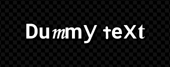
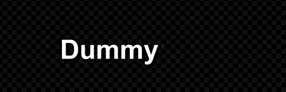
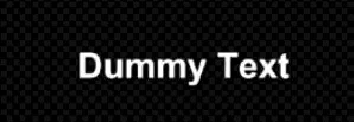

<h1 id="-português"></h1>

  

  <h1>Aegisub - TenshoScripts</h1>

  

    O <strong>TenshoScripts</strong> é um toolkit essencial de automação para Aegisub, desenvolvido especificamente para legendas da cena <strong>Nerdcore</strong> e <strong>AMVs</strong>. Esta versão foca em ferramentas fundamentais para agilizar o workflow de legendas para YouTube.
  

  
   

  
  

---

## ✨ Funcionalidades Inclusas (Gratuito)

| Ferramenta | Descrição |
| :--- | :--- |
| **Fadeworks Adaptado** | Aplica fades (in/out) normais, por alpha/cor ou letra por letra (`LTR`, `RTL`, `Meio->Fora`, `Fora->Meio`). |
| **Gradiente Fácil** | Gradientes horizontais calculados automaticamente letra por letra com até 5 cores chave ou automaticamente por Estilos. |
| **Piscadas** | Alternância rítmica de cores para impacto visual na batida. |
| **Dividir Linhas** | Divide frases em camadas individuais por caractere ou palavra. |
| **Transformar** |	Cria animações de transformação (`\t`) automáticas para cores (`\1c` a `\4c`), tamanho (`\fs`) e transparência (`\alpha`). |
| **Texto & Fotnes FX** |	Suíte de motion tipográfico com 5 efeitos integrados: Typewriter, Embaralhar (Hacking), Inversão Espelhada, Caos de Símbolos e Variação de Fontes, com suporte a centralização dinâmica. |
| **Fixar Linhas** | Posicionamento rápido (`\an5`) em Topo, Meio ou Baixo. |
| **YtktFade** | Aplique o karaokê invisível do YouTube com cor configurável (`\2c`) a multiplas linhas ao mesmo tempo. |

Veja mais sobre como as minhas automações funcionam [aqui](https://github.com/yujifkw/TenshoScripts/blob/main/HELP.md).

---

## 💎 TenshoScripts + (Versão Paga)

Deseja elevar o nível das suas legendas? A versão **Exclusive** automatiza efeitos complexos que antes só seriam possíveis em softwares de edição de vídeo pesados.

* 📺 **Glitch Dinâico:** Aberração cromática dinâmica com suporte de cores automáticas baseadas no Estilo e na posição relativa da linha.
* 🌊 **Onda Arco-Íris:** Onda cromática dinâmica com fatiamento milimétrico de 5ms.
* 🎵 **Karaoke Reverso:** Sistema de sumiço de sílabas automático com base nas divisões de karaoke (`\k`).
* 📈 **Curvas [BETA]:** Suavização de movimento baseada em Curvas de Bézier (`\move`).

 

  

 

---

## 📸 Demonstração Visual

  <table>
    <tr>
      <td align="center" width="50%"><strong>1. Fadeworks Adaptado</strong> </td>
      <td align="center" width="50%"><strong>2. Gradiente Fácil</strong> </td>
    </tr>
    <tr>
      <td align="center" width="50%"><strong>3. Piscadas</strong> </td>
      <td align="center" width="50%"><strong>4. Dividir Linhas</strong> </td>
    </tr>
    <tr>
      <td align="center" width="50%"><strong>5. Transformar</strong> </td>
      <td align="center" width="50%"><strong>6. Texto & Fontes FX</strong> </td>
    </tr>
    <tr>
      <td align="center" width="50%"><strong>7. YtktFade (YouTube)</strong> </td>
      <td align="center" width="50%"><strong>8. Fixar Linhas</strong> </td>
    </tr>
    <tr>
      <td align="center" width="50%"><strong>9. Glitch Dinâmico (Pago)</strong> </td>
      <td align="center" width="50%"><strong>10. Onda Arco-Íris (Pago)</strong> </td>
    </tr>
    <tr>
      <td align="center" width="50%"><strong>11. Karaoke Reverso (Pago)</strong> </td>
      <td align="center" width="50%"><strong>12. Curvas (Pago) - BETA</strong> </td>
    </tr>
  </table>
  
Recarregue a página caso os GIFs congelem.

---

## 🚀 Como Instalar

1. Baixe a versão mais recente do script na página de [**Releases**](../../releases).
2. Acesse a pasta do Aegisub: Pressione `Win+R` -> digite `%APPDATA%\Aegisub`.
3. Coloque o arquivo `.lua` dentro da pasta `automation/autoload`.
4. No Aegisub, acesse pelo menu `Automação -> -TenshoScript`.

---

## 🔗 Links Úteis

* [**Aegisub-Modified**](https://github.com/arch1t3cht/Aegisub/releases/tag/feature_12): Versão com suporte a **Pastas** (organização de linhas) e tema escuro.
* [**YTSubConverter**](https://github.com/arcusmaximus/YTSubConverter): Conversor essencial para o formato `.ytt` (YouTube).

---

## ⚖️ Licença

Este projeto está sob a licença **MIT**. Veja o arquivo `LICENSE` para mais detalhes.

 

  
Feito com ❤️ por <strong><a href="https://x.com/otenshy">Tensho</a></strong>

 
 
 

<h1 id="-english"></h1>

  

  <h1>Aegisub - TenshoScripts</h1>

  

    <strong>TenshoScripts</strong> is an essential automation toolkit for Aegisub, specifically developed for the <strong>Nerdcore</strong> and <strong>AMV</strong> scene. This version focuses on fundamental tools to streamline the subtitle workflow for YouTube.
  

  
   

  
  

---

## ✨ Included Features (Free)

| Tool | Description |
| :--- | :--- |
| **Adapted Fadeworks** | Applies normal fades (in/out), via alpha/color, or letter-by-letter (`LTR`, `RTL`, `Middle->Out`, `Out->Middle`). |
| **Easy Gradient** | Horizontal gradients automatically calculated letter-by-letter using up to 5 key colors or automatically by Styles. |
| **Flashes** | Rhythmic color alternation for visual impact synced to the beat. |
| **Split Lines** | Divides sentences into individual character or word layers. |
| **Transform** | Creates automatic transformation animations (`\t`) for colors (`\1c` to `\4c`), size (`\fs`), and transparency (`\alpha`). |
| **Text & Fonts FX** | A typographic motion suite with 5 integrated effects: Typewriter, Shuffle (Hacking), Mirror Inversion, Symbol Chaos, and Font Variation, with support for dynamic centering. |
| **FixLines** | Quick `\an5` positioning for Top, Middle, or Bottom screen placement. |
| **YtktFade** | Apply the invisible YouTube karaoke effect with configurable color (`\2c`) to multiple lines at the same time. |

Learn more about how my automations work [here](https://github.com/yujifkw/TenshoScripts/blob/main/HELP.md).

---

## 💎 TenshoScripts + (Paid Version)

Want to level up your subtitles? The **Exclusive** version automates complex effects that were previously only possible in heavy video editing software.

* 📺 **Dynamic Glitch:** Dynamic chromatic aberration with automatic color support based on Style and relative line positioning.
* 🌊 **Rainbow Wave:** Dynamic chromatic wave with ultra-precise 5ms temporal slicing.
* 🎵 **Reverse Karaoke:** Automatic syllable disappearance system based on karaoke timings (`\k`).
* 📈 **Curves [BETA]:** Movement smoothing/easing based on Cubic Bézier Curves (`\move`).

 

  

 

---

## 📸 Visual Demonstration

  <table>
    <tr>
      <td align="center" width="50%"><strong>1. Adapted Fadeworks</strong> </td>
      <td align="center" width="50%"><strong>2. Easy Gradient</strong> </td>
    </tr>
    <tr>
      <td align="center" width="50%"><strong>3. Flashes</strong> </td>
      <td align="center" width="50%"><strong>4. Split Lines</strong> </td>
    </tr>
    <tr>
      <td align="center" width="50%"><strong>5. Transform</strong> </td>
      <td align="center" width="50%"><strong>6. Random Fonts</strong> </td>
    </tr>
    <tr>
      <td align="center" width="50%"><strong>7. YtktFade (YouTube)</strong> </td>
      <td align="center" width="50%"><strong>8. FixLines</strong> </td>
    </tr>
    <tr>
      <td align="center" width="50%"><strong>9. Dynamic Glitch (Paid)</strong> </td>
      <td align="center" width="50%"><strong>10. Rainbow Wave (Paid)</strong> </td>
    </tr>
    <tr>
      <td align="center" width="50%"><strong>11. Reverse Karaoke (Paid)</strong> </td>
      <td align="center" width="50%"><strong>12. Curves (Paid) - BETA</strong> </td>
    </tr>
  </table>
  
Reload the page if the GIFs freeze.

---

## 🚀 How to Install

1. Download the latest version of the script on the [**Releases**](../../releases) page.
2. Access the Aegisub folder: Press `Win+R` -> type `%APPDATA%\Aegisub`.
3. Place the `.lua` file inside the `automation/autoload` folder.
4. In Aegisub, access it via the `Automation -> -TenshoScript` menu.

---

## 🔗 Useful Links

* [**Aegisub-Modified**](https://github.com/arch1t3cht/Aegisub/releases/tag/feature_12): Version with support for **Folders** (line organization) and dark theme.
* [**YTSubConverter**](https://github.com/arcusmaximus/YTSubConverter): Essential converter for the `.ytt` format (YouTube).

---

## ⚖️ License

This project is licensed under the **MIT License**. See the `LICENSE` file for more details.

 

  
Made with ❤️ by <strong><a href="https://x.com/otenshy">Tensho</a></strong>

