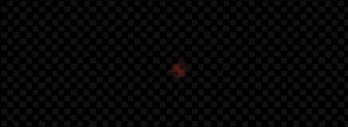
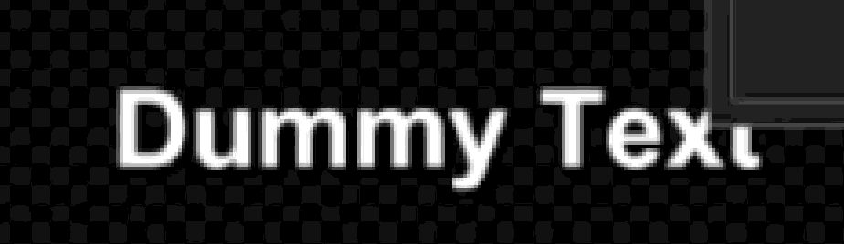
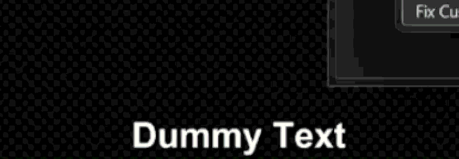
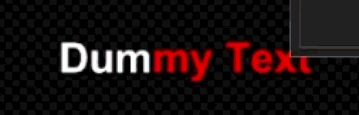
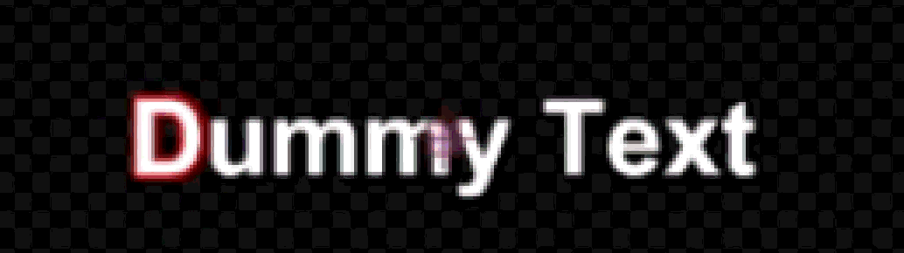
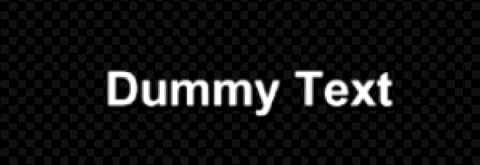

  
  

 

<h1 id="-português"></h1>

  <h1>TenshoScript v1.0</h1>

  

    O toolkit essencial de automação para Aegisub, otimizado para a cena <strong>Nerdcore</strong> e <strong>AMVs</strong>.
  

  

    
    
    
  

   

  
  
   
   

---

## ✨ Funcionalidades Inclusas (Gratuito)

| Ferramenta | Descrição |
| :--- | :--- |
| **Fadeworks Adaptado** | Aplica fades (in/out) normais, por alpha/cor ou letra por letra. |
| **Glitch** | Aberração cromática dinâmica com suporte a cores automáticas do Estilo. |
| **Flashes** | Alternância rítmica de cores para impacto visual na batida. |
| **Gradient** | Gradientes horizontais letra por letra com até 5 cores chave. |
| **Split Lines** | Divide frases em camadas individuais por caractere ou palavra. |
| **FixLines** | Posicionamento rápido (`\an5`) em Topo, Meio ou Baixo. |
| **YtktFade** | O clássico karaokê do YouTube com transparência configurável. |

---

## 💎 TenshoScript Exclusive (Versão Paga)

Deseja elevar o nível das suas legendas? A versão **Exclusive** automatiza efeitos complexos que antes só seriam possíveis em softwares de edição de vídeo pesados.

* 🌊 **Rainbow Wave:** Onda cromática dinâmica com fatiamento milimétrico de 5ms.
* 📈 **Curves:** Suavização de movimento baseada em Curvas de Bézier Cúbicas (Flow AE style).
* 🎵 **Reverse Karaoke:** Sistema de sumiço de sílabas por camadas (anti-bug YouTube).

👉 **[Adquira a versão Exclusive no meu Cardd](https://seulinkaqui.cardd.co)**

---

## 📸 Demonstração Visual

  <table>
    <tr>
      <td align="center" width="50%"><strong>1. Fadeworks Adaptado</strong> </td>
      <td align="center" width="50%"><strong>2. Glitch Dinâmico</strong> </td>
    </tr>
    <tr>
      <td align="center" width="50%"><strong>3. Flashes</strong> </td>
      <td align="center" width="50%"><strong>4. Gradient</strong> </td>
    </tr>
    <tr>
      <td align="center" width="50%"><strong>5. Split Lines</strong> </td>
      <td align="center" width="50%"><strong>6. FixLines</strong> </td>
    </tr>
    <tr>
      <td align="center" width="50%"><strong>7. YtktFade (YouTube)</strong> </td>
      <td align="center" width="50%"><strong>8. Rainbow Wave (Exclusive)</strong> </td>
    </tr>
    <tr>
      <td align="center" width="50%"><strong>9. Curves (Exclusive)</strong> </td>
      <td align="center" width="50%"><strong>10. Reverse Karaoke (Exclusive)</strong> </td>
    </tr>
  </table>

---

## 🚀 Como Instalar

1. Baixe a versão mais recente do script na página de [**Releases**](../../releases).
2. Acesse a pasta do Aegisub: Pressione `Win+R` -> digite `%APPDATA%\Aegisub`.
3. Coloque o arquivo `.lua` dentro da pasta `automation/autoload`.
4. No Aegisub, acesse pelo menu `Automação -> -TenshoScript`.

---

## 🔗 Links Úteis

* [**Aegisub-Modified**](https://github.com/arch1t3cht/Aegisub/releases/tag/feature_12): Versão com suporte a **Pastas [Actor]**, organização de linhas e tema escuro.
* [**YTSubConverter**](https://github.com/arcusmaximus/YTSubConverter): Conversor essencial para o formato `.ytt` (YouTube).

---

## ⚖️ Licença

Este projeto está sob a licença **MIT**. Veja o arquivo `LICENSE` para mais detalhes.

 

  
Feito com ❤️ por <strong>Tensho</strong>.

